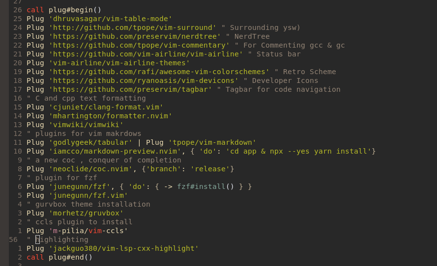

# [Neovim](https://github.com/neovim/neovim/tree/master)

## *My plugins*


## 1- Installation  

```bash 
sudo snap install nvim --classic
```
## 2- Configuration: 
- Create configuration file for `neovim`
```bash 
mkdir ~/.config/nvim 
#copy the configuration file to ~/.config/nvim  
```
## 3- Requirements for Neovim 
```bash 
# tool to enable neovim to copy text to the clipboard
sudo apt install xclip
```
### `Vim-Plug` setup: 
As a plugin manager i am using `Vim-Plug`.<br> 
[Vim-Plug](https://github.com/junegunn/vim-plug)
```bash 
sh -c 'curl -fLo "${XDG_DATA_HOME:-$HOME/.local/share}"/nvim/site/autoload/plug.vim --create-dirs https://raw.githubusercontent.com/junegunn/vim-plug/master/plug.vim'
```
Reload the file or restart `neovim`, then you can:
- `:PlugInstall` to install the plugins
- `:PlugUpdate` to install or update the plugins
- `:PlugDiff` to review the changes from the last update
- `:PlugClean` to remove plugins no longer in the list

### `coc-nvim` setup: 

```bash
# installing nodejs >= 16.18.0

curl -o- https://raw.githubusercontent.com/nvm-sh/nvm/v0.39.7/install.sh | bash
source .bashrc 
nvm install 20 
node -v # should print `v20.15.0`

npm install --global yarn

```
### `vim-devicons` setup: 

```bash 
copy the fonst folder in your .fonts dir 
```
###  `vim-commentary` setup 
[vim-commentary](https://github.com/tpope/vim-commentary)
- To comment use `gcc`
- To comment in visual mode `gc`
- To uncomment `gcgc`
###  `Tagbar` setup 
[Tagbar ](https://github.com/preservim/tagbar)
```bash
sudo apt install universal-ctags
```
### `Fzf` setup 
```conf
- <C-P> to search files  
" to open the file you can hit enter to oepn it or 
" C-t to open in other tab 
" C-v to open in vertical split 
" C-x  to opeb in horizontal split 
```
### Setup C and cpp environement using `coc-nvim`
[coc-clangd](https://github.com/clangd/coc-clangd)
[ccls](https://github.com/MaskRay/ccls?tab=readme-ov-file)
[coc-ccls](https://github.com/Maxattax97/coc-ccls)
[vim-lsp-cxx-highlight](https://github.com/jackguo380/vim-lsp-cxx-highlight/blob/master/sample-configs/coc-settings.json)
- `:CocInstall coc-clangd`
- `coc-clangd` will try to find `clangd` from your `$PATH`, if not found, you can run `:CocCommand clangd.install`
- `:CocInstall coc-ccls`
- `sudo apt install bear`
-  `sudo apt install ccls` : language server 
 >**Note**: 
 >Not fully configured yet
- To setup the environment for  a `C` or `cpp` project : 
```bash 
# crete  a makefile for your project 
bear -- make # it will create a compile_commands.json 
```
 >**Note**: 
 >probably going to switch to `Lua` configuration
## References: 
https://www.youtube.com/watch?v=ViHgyApE9zM
