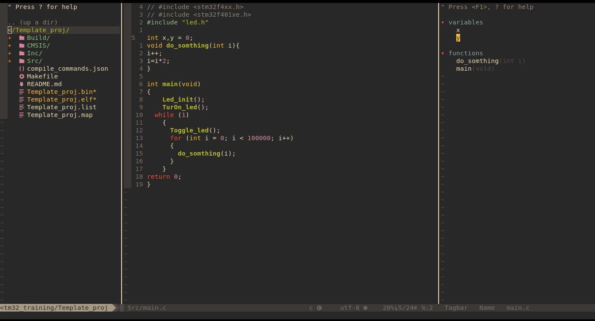

# MyDotfile
#### Requirement to install before 
```bash 
sudo apt update && sudo apt install git curl build-essential make
```

# ***[Neovim setup](Neovim-setup.md)*** 



A terminal Text editor 
## Features:  
- `vim-plug` as plugin manager
- environment for `c` and `cpp` projects 
- `coc-nvim` for auto-completion
- ...
## keybindings
...
 
# ***[i3 setup](i3-setup)***

[i3](https://i3wm.org/) is a light and powerful tiling window manager. 
I am using [i3-gaps](https://github.com/Airblader/i3) a fork from `i3`
## Features:
- **Custom Keybindings for Productivity**:
    - Launch applications like Terminal, `Rofi`, and various others with simple key combinations.
    - Control multimedia (volume, brightness) and system functions (lock screen, sleep) with dedicated keybindings.
- **Workspace and Window Management**:
    - Easily switch between and manage work-spaces .
    - Resize, move, and focus windows efficiently using window key. 
- **Visual and System Enhancements**:
    - `Picom` for window compositing with custom configuration.
    - Custom colors and gaps for a tailored look and feel.
    - Auto-start utilities for enhanced system functionality 
    - Custom bash scripts 
#### ***[My Keybindings](i3-keybindings)***

>**Note**
>Fee free to change these configurations as suits you
# Oh_my_bash setup 

[Oh my bash](https://github.com/ohmybash/oh-my-bash) is a tool for managing bash configuration 
## Installation
```bash
# install oh-my-bash 
bash -c "$(curl -fsSL https://raw.githubusercontent.com/ohmybash/oh-my-bash/master/tools/install.sh)"
# copy the oh-my-bash config file to .config 
cp -r oh-my-bash/ .config 
# copy the bashrc file to your home dir  
cp -r .bashrc . 
# update the path of oh-my-bash in the .bashrc  configuration 
export OSH="home_dir_path/.config/oh-my-bash";
# source the .bashrc 
source .bashrc
```

>**Note**
>Fee free to change the configurations as suits you

# Kitty  setup
[Kitty](https://github.com/kovidgoyal/kitty) is a terminal
## Installation 
```bash 
sudo apt install kitty 
# copy the kitty config file to ./config 
cp -r kitty .config/ 
```

>**Note**
>Fee free to change the configurations as suits you

# Ranger 
[Ranger](https://github.com/ranger/ranger) is a terminal file manager. 
## Installation 
```bash 
sudo apt install ranger 
# copy the ranger config file to ./config 
cp -r ranger .config 
```

>**Note**
>Fee free to change the configurations as suits you

# My application: 
 - `Brave Browser` : My browser has a built-in Tor and Add blocker   
 - `qbitorrent` : Downloads Torrent links 
 - `tldr` : A command line tool that helps trouble shoot some command lines 
 - `viu`: view images on terminal (I need `cargo a rust package management`) [viu](https://github.com/atanunq/viu)
 - `mdcat`: Pretty prints `.md` files on terminal 
 - `fzf` : Search for files and directory 
 - `Obsidian`: My note taking app
```bash
sudo snap install obsidian --classic
sudo apt install fzf mdcat tldr qbittorrent

```
